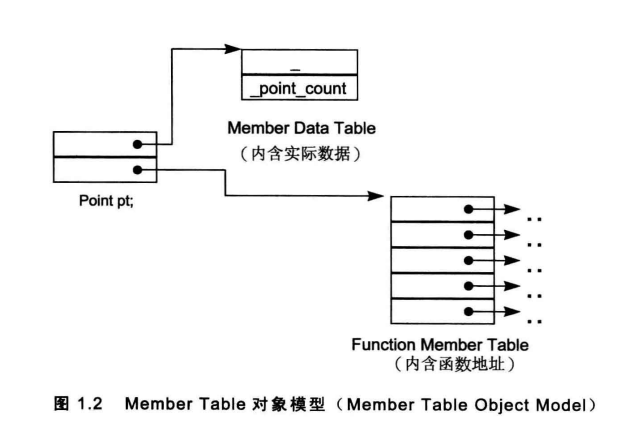

# C++对象模型
## 什么是C++对象模型:
语言中直接支持面向对象程序设计的部分,对于各个支持的底层实现机制。

## C++对象模型(The C++ Object Model)

```cpp
#include <iostream>
using  std::ostream;
 
class Point {
    public:
    Point(float xval);                            // 构造函数
    virtual ~Point();                             // 虚析构函数
 
    float x() const;                              // 非静态函数（只读）
    static int PointCount();                      // 静态函数
 
protected:
    virtual ostream& print(ostream& os) const;    // 虚函数（只读）
 
    float _x;                                     // 非静态变量
    static int _point_count;                      // 静态变量
} ;
 
 
int main(int argc, char** argv) {
 
 
    system("pause");
    return 0;
}
```
- 每个非内联(non-inline)成员函数只会诞生一个函数实例. 而内联函数会在每个使用者身上产生一个函数实例.
- C++在布局以及存取时间上的额外负担主要由虚(virtual)引起的:
    1. 虚函数机制(virtual function)用于支持一个有效率的运行期绑定(runtime binding).
    2. 虚基类(virtual base class) 用以实现多次出现在继承体系中的基类, 有一个单一而被共享的实例.
    3. 额外负担, 派生类转换。
- 在C++ 中，有两种静态的数据成员（static）、非静态的数据成员（nonstatic）；
- 有三种成员函数：静态的函数（static）、非静态的函数（nonstatic）、虚函数（virtual）

### 简单对象模型（A Simple Object Model）
思想：
对象内放着指向成员的指针(原文为slots(元素, 位置, 槽))，而不是放着成员本身。

优缺点：
- 优点：设计简单，指针的大小是固定的，这种模型可以避免“不同类型members需要不同存储空间”的问题
- 缺点：多了一层间接性，空间和执行期效率稍低。
应用：
未实际应用。

### 表格驱动对象模型（A Table-driven Object Model）
思想：
类对象内含指针指向两个表，一个表(数据成员表)存放实际数据，另一个表(成员函数表)内存放函数地址。

优缺点：
- 优点：弹性较大，可以修改成员变量
- 缺点：多了一层间接性，付出了空间和执行效率的代价

应用：
未实际应用，但是member function table这个观念被采用。

### C++对象模型（The C++ Object Model）
思想：
是从简单对象模型派生来的，并对内存空间和存取时间做了优化。

**非静态数据成员**在对象内，**静态数据成员**在对象外，**静态和非静态成员函数**也被放在对象外。
**虚函数** 虚函数利用虚表(vbtl)和虚表指针(vptr)设置.
1. 每一个类产生出一堆指向虚函数的指针，放在表格之中．这个表格被称为**虚函数表(vtbl)**。
2. 每一个类对象被添加了一个指针，指向相关的**虚函数表**。通常这个指针被称为**虚指针(vptr)**
3. vptr的设定(setting）和重置（resetting)都由每一个类的 构造, 析构和copy赋值运算符自动完成(在第5章讨论)。
4. 每个类所关联的 type_info(类型信息)的对象(用以支持runtime type identification，RTTI)也经由**虚表**指出，通常是放在表格的第一个槽(slot)处。

优缺点：
- 优点：空间和存取时间的效率较高
- 缺点：如果非静态成员变量修改，代码需要重新编译。

## 继承模型
虚拟继承：基类不管被派生多少次，永远只会存在一个实例（subobjet），解决菱形继承问题

### 简单对象模型
- 思想：每一个基类在派生类中都有指针指向它。
- 优点是对象的大小不会因为基类的改变而受影响。
- 缺点：间接性，导致空间和存取时间上的额外负担。

### base table模型
- 思想：对象含有指针指向一张base table，表格中含有每一个基类的地址
- 优点：
1. 每一个对象对于继承都有一致的表现方式：每一个 类对象 都应该在某个固定位置上安放一个 base table 指针，与基类的大小、个数无关。
2. 无须改变 class objects本身，就可以放大、缩小，或更改 base class table。
- 缺点：间接性，导致空间和存取时间上的额外负担。

### C++继承模型
- 思想：不运用任何间接性，基类的数据成员直接放在派生类对象中。虚基类另外讨论（直接放会导致多份数据）。
- 优点：没有间接性
- 缺点：基类成员的任何改变，都让用到它的派生类重新编译。

## 总结
- 在虚拟继承的情况下, 基类不管在继承串链中被派生多少次, 永远只会存在一个实例.
- 基类和派生类的数据成员的布局没有谁先谁后的强制规定, 但使用初始化列表时, 必须保持成员变量顺序的一致性.
